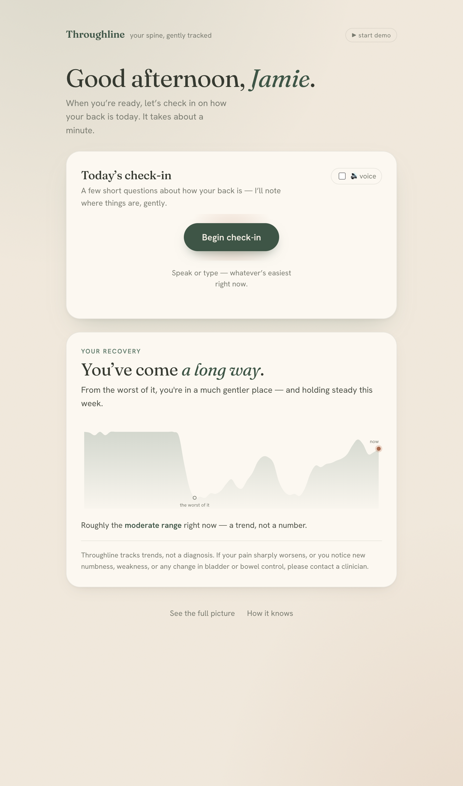

# Throughline

### *Your spine, understood.* A recovery companion that tracks a sciatica flare from your phone — and is honest about what it can and can't see.

> **"I tried to teach Claude Opus to predict my flare-ups — here's what it actually learned, including where it told me to stop overclaiming."**

**▶ Live:** **https://throughline-spine.fly.dev**  ·  **MCP connector:** `https://throughline-spine.fly.dev/mcp` (add as a custom connector in claude.ai)  ·  **Model:** Claude **Opus 4.8**

<p align="center">
  
</p>

---

## Why this exists

> A year ago I was in this room for the #1 AI Engineer hackathon. A week later I collapsed in the street from a spine-injury flare — three months of severe sciatica, chronic pain, stuck on my bedroom floor. A year on I've recovered 99%, but the injury remains. Obsessing about avoiding the next flare is no way to live. So I built a harness around Claude Opus to manage it — for people with spine injuries.

When you're in a severe flare, you live and die by the recovery chart. Throughline **fills that chart in for you** — passively, from the phone already in your pocket — and **Opus narrates which way you're heading, honestly.**

## The moat: Opus as scientist, skeptic, *and* companion

Anyone can fit a line to data. The hard part — and the reason this is built around Opus — is **proving the signal is real, and refusing to oversell it.** Opus runs the whole methodology and then **attacks its own result**: it discovers which passive signals carry severity, calibrates them to the validated Modified Oswestry (MODQ) score, runs a circularity test, forward-validation, and a lead/lag analysis — then **grades every user-facing sentence against a YMYL honesty rubric.**

**Honesty is the feature.** The product ships its own *"what's proven vs. not"* scorecard. That self-auditing is the trust layer a health AI needs — and it's what makes a demo land with the people who build Claude.

## The demo (one button, ~90 seconds)

Tap **▶ start demo** on the live site and it runs end to end:

1. **A Telegram nudge** arrives — *"time for today's check-in."*
2. **Tap through** to a calm, pain-friendly home.
3. **Opus 4.8 runs the Modified Oswestry as a 30-second conversation** (voice or text) and scores it live.
4. **"Building your picture"** — Calendar, Apple Health, and Whoop animate in.
5. **The read:** your recovery curve, an *elevated-risk window* with the converging factors, and a concrete **de-load plan** — plus a one-tap Telegram routine to nudge you through it.

## What the data actually shows (n = 1, one real episode)

Validated on a fully-instrumented episode: ER 27 Jun 2025 → MODQ trough 82 → relapse late Aug → recovered to 12 by 1 Oct.

| Metric | Value |
|---|---|
| Index ↔ MODQ calibration | **R² = 0.69** · LOO MAE **10.5** |
| Out-of-sample *direction* (block test — caught the relapse cold) | **r = 0.94** |
| Honest forward error | MAE ≈ **14.9** |
| Not a tautology — gait predicts non-walking items | pain **r = 0.79**, sleep **r = 0.69** |
| Does gait *lead* worsening? | **No** — coincident-to-lagging (peak at lag 0) |

**The headline isn't accuracy — it's a *trustworthy direction* signal**, with the limits stated out loud. Full record: [`docs/methodology-evidence.md`](docs/methodology-evidence.md).

## The Opus surfaces (what's actually built)

- **Conversational PROM** — Opus 4.8 administers the 10-section Modified Oswestry as a short, adaptive chat and maps it faithfully to the validated 0–100 score via a strict tool. ([`app/server/interview.ts`](app/server/interview.ts))
- **Remote MCP connector** — a live Streamable-HTTP server exposing `get_trajectory`, `get_risk`, `get_evidence` (the scorecard), `run_checkin`, and `send_telegram`. Ask claude.ai *"how's my back this week — am I at risk?"* and Opus answers from real data, honestly. ([`app/server/mcp.ts`](app/server/mcp.ts))
- **Agentic self-audit** — a dynamic workflow where Opus writes the proven-vs-not verdict, narrates each day, and a judge **grades every output against the honesty rubric**; "done" = 100% pass. ([`app/scripts/brain.workflow.js`](app/scripts/brain.workflow.js))
- **Deterministic brain** — index, trend, turning points, leading-signal risk flags, and a **damped, mean-reverting forecast** (numbers computed, never hallucinated). ([`app/scripts/brain.py`](app/scripts/brain.py))
- **Honesty skill** — a `SKILL.md` carrying the rubric so Opus reasons with the right discipline. ([`app/skills/throughline-companion/SKILL.md`](app/skills/throughline-companion/SKILL.md))
- **Calm, pain-first web app + Telegram reminders** — a warm, distinctive UI (the check-in is the hero) and a daily Telegram nudge a Claude Routine can fire.

## How it maps to the judging criteria

| Criterion | Weight | Why |
|---|---:|---|
| **Impact** | 35% | Low back pain is the world's #1 cause of disability (~600M people). Getting through a flare today, and working toward seeing the next one coming, is real, urgent, and personal. |
| **Demo** | 35% | Runs on a **real, validated episode** — a live conversational MODQ, the replayed flare→relapse→recovery, and a multi-source forward read with a plan. |
| **Opus 4.8** | 15% | Conversational PROM + autonomous, *self-critiquing* data science + YMYL self-grading. Well beyond a chatbot. |
| **Orchestration** | 15% | The methodology **is** the workflow: ingest → discover → calibrate → ‖circularity · forward · lead/lag‖ → grade → emit. "Done" = passes the gates; reruns on any dataset. |

## What we *don't* claim

Honesty, in the README too: this is **n = 1, one episode**, not clinically validated. Gait is a *consequence* of pain, not a precursor — so the model **does not predict flare onset**; early-warning is an instrumented hypothesis, clearly labelled. Trends, not points. No diagnosis, no precise prognosis. The full guardrails and validation gates: [`rubric.md`](rubric.md).

## Architecture & stack

Web app — **Vite + React + TypeScript** (calm UI, Chart.js + a bespoke recovery curve) · **Hono** API · **better-sqlite3**. The **MCP server** (`@modelcontextprotocol/sdk`, stateless Streamable HTTP) is mounted on the same listener and reads the same DB. The **brain** (Python) computes the timeline offline; the app reads & replays. Deployed on **Fly.io** (region `sjc`, volume-backed SQLite, single machine — SQLite is single-writer). Telegram via the Bot API. Dev/stack details: [`app/README.md`](app/README.md).

## Repo map

| Path | What it is |
|---|---|
| [`brief.md`](brief.md) | Vision, three pillars, judging-criteria map, definition of "done" |
| [`rubric.md`](rubric.md) | The validation + YMYL honesty gates, and how they're enforced |
| [`docs/methodology-evidence.md`](docs/methodology-evidence.md) | The full empirical record — analysis, validation, the proven-vs-not scorecard |
| [`narrative.md`](narrative.md) | The founder story, in voice |
| [`app/`](app/) | The web app, MCP server, interviewer, brain, and honesty skill |
| [`docs/open-datasets.md`](docs/open-datasets.md) | External datasets for cross-person validation (future track) |
| [`BUILD_PLAN.md`](BUILD_PLAN.md) | Build state + handoff |

## Run it locally

```sh
cd app
pnpm install
python3 sources/weather.py && python3 scripts/brain.py && pnpm seed   # regenerate the timeline + seed
echo 'ANTHROPIC_API_KEY=sk-ant-...' > .env                            # for the live Opus check-in
pnpm dev                                                              # client :5173 → API/MCP :8080
```

---

*Built for the Anthropic hackathon. I didn't build an app — I taught Opus to understand a spine, honestly.*
